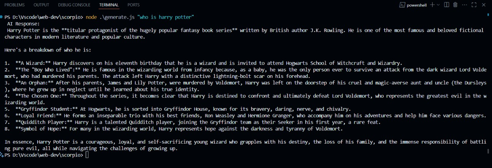

# 🦂 Scorpio – Terminal Chatbot AI

**Scorpio** is a terminal-powered AI chatbot that provides intelligent responses to user queries, simulating a natural text-based conversation in your command line. Built using Node.js and powered by language generation logic, it’s a clean, extendable base for terminal AI bots.

---
## 📚 What I Learned

- Learned how to integrate and use Google's Gemini API with Node.js to generate intelligent text responses in a terminal interface.
- Gained hands-on experience with command-line argument parsing, API calling, async functions, and JSON handling in a Node.js environment.
- Improved understanding of chatbot logic, Markdown formatting, and how to document terminal-based projects effectively on GitHub.


## 🧠 Example Interaction



> Scorpio responding to the query: `"who is harry potter"`  
> The bot provides a detailed, structured AI answer directly inside the terminal.

---

## 🚀 Features

- 🖥️ Fully command-line based
- ✨ Rich, structured output using Markdown formatting
- ⚡ Quick setup with minimal dependencies
- 🤖 Extendable logic for various use cases (chat, learning bots, Q&A, etc.)

---

## 📦 Installation

### 1. Clone the repository

```bash
git clone https://github.com/iamAdil95/Scorpio.git
cd Scorpio

Made by Adil ❤
